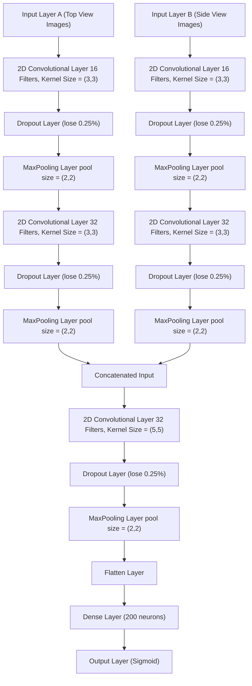

# Binary Classification of Neutrino Interactions
This repository contains the code and report for the Neutrino Interactions Project completed in 2024 for the Practical Machine Learning for Physicists course at UCL.

Below is a brief overview of project, covered in detail in the [project report](https://github.com/Sim-Ood/Binary-Classification-of-Neutrino-Interactions/blob/main/Classifying%20Neutrinos%20Report.pdf)

## Introduction

The aim of this project is to train a machine learning classifier on simulated images resembling the particle tracks made in the NOvA detector, to identify muon neutrino charged-current (CC) events. The secondary aim is to investigate the relationship between the image metadata, such as neutrino energy, and the performance of the classifier. There were 200 available files of data for this project which contained paired detector images (a top view and a side view) of neutrino interactions and their associated metadata.

## Preprocessing Data

There are 17 classes of interaction, 4 of which are $\nu_{\mu}$ CC. By relabelling $\nu_{\mu}$ CC type events as 1 and all other classes as 0, the data is prepared for binary classification where 1 is positive and 0 is negative. The dataset is imbalanced with 88.24% of samples in the positive class, and 11.76% of samples in the negative class. Consequently, if the model learnt to label all samples as positive instead of distinguishing between positive and negative results, it could still achieve a misleading accuracy around 88%. To address this the following strategies are considered.

- Resample the dataset to overrepresent the negative class and balance the distribution of samples over the two classes.
- Implement class weights in the loss function to increase the penalty for incorrectly classified negative samples.
- Evaluate model performance on multiple metrics alongside accuracy.
- Identify the optimal threshold at which the model's probability scores is classed as positive and recalculate the accuracy. 

High Energy Physics (HEP) experiments can generate immense quantities of data on rapid timescales. In a real world application of the binary classifier, resampling a vast training dataset may be too costly for a budget of limited resources. Furthermore, manipulating the distribution of the dataset may obscure undiscovered patterns that could potentially provide insight into the interaction physics. Hence, this project focuses on the latter 3 strategies. The dataset is split into 80% training samples, 10% validation samples, and 10% testing samples. 

## Model Architecture

The classifier model applies convolutional neural network (CNN), pooling, and dropout layers to the image data. The side and top view images for each interaction are taken as two separate inputs. The model is trained on a batch size of 32 for 20 epochs with 450 steps per epoch. 

## Model Performance

During testing, the trained model outputs a probability score between $0-1$ for each testing sample. Testing samples with probability scores exceeding the chosen threshold are classed as positive. Samples with scores at or below the threshold are classed as negative. The model's accuracy for the positive and negative test samples are considered separately to gain better insight into its overall performance. The model's predictions are evaluated over a range of thresholds to identify the optimal threshold which maximises the overall accuracy.

    

On this optimal threshold, the relationship between the model's performance and metavariables are investigated. The project considers the model's dependence on the neutrino energy, lepton energy, and the interaction type for interactions in the testing dataset. Whilst accuracy fluctuates seemingly randomly with neutrino energy, the model performs especially well on interactions with high neutrino energy. For lepton energy, a general trend of increasing accuracy with increasing energy is observed and, as with neutrino energy, the model achieves high accuracies for samples with high lepton energy. 

    

Comparing images for high and low lepton energy provides insight into why the model's performance appears dependent on lepton energy. High lepton energy interactions produce clearer particle tracks, whereas the tracks made in low energy interactions are more visually complicated.

    

Investigating accuracy for different interaction types further suggets that model performance is dependent on the visual complexity of particle tracks. The model performs notably worse on deep inelastic scattering (DIS) type interactions, in which multiple tracks can be created, contributing to a "messy" detector image.  

    

## References

See the [project report](https://github.com/Sim-Ood/Binary-Classification-of-Neutrino-Interactions/blob/main/Classifying%20Neutrinos%20Report.pdf) for references and full details of the project findings.

